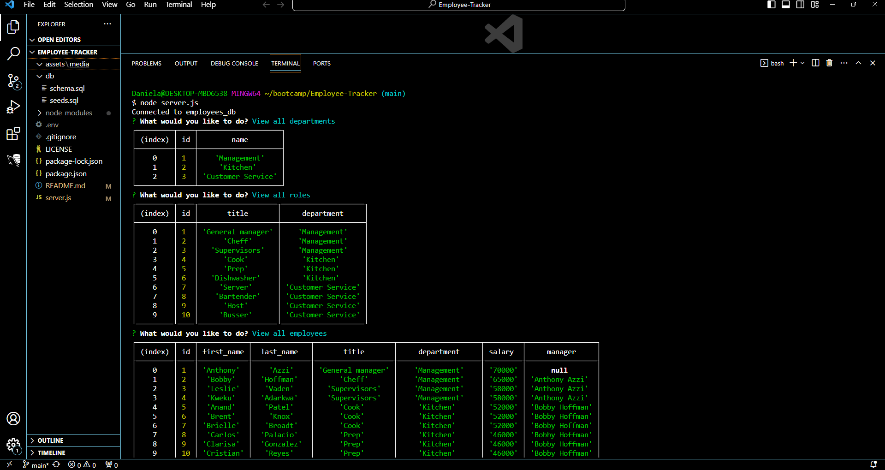

# Employee-Tracker

  
   

  ## Table of Contents
  - [Description](#description)
  - [Installation](#installation)
  - [Usage](#usage)
  - [Credits](#credits)
  - [License](#license)
  - [Contributing](#contributing)
  - [Test](#tests)
  - [Questions](#questions)

  ## Description
  - This app users to view and manipulate the an emplyoee database through the terminal using inquirer and mysql technologies.
  - Users are prompted with seveal option:

        -View all departments, 
        -View all roles, 
        -View all employees, 
        -Add a department, 
        -Add a role, 
        -Add an employee, 
        -Update an employee role,
        -View employees by department,
        -View employees by manager,
        -Delete departments,
        -Delete roles,
        -Delete employees

  - When users choose any of the view options a table with the desired data shows up in the terminal.
  - The add options prompt the users with more questions about the data that they want to create.
  - The delete options allow users to delete the data.
  
  - [ Video link](https://drive.google.com/file/d/1OPvqVyv2_UtivDRObHRmrj4J60XV1gI_/view)

  - [ Heroku Deploy ]()

  ## Installation
  - node js
  - npm i inquirer@8.2.4
  - mysql -u root -p
    - SOURCE schema.sql;
    - SOURCE seeds.sql;
  - git clone https://github.com/YemnyFeliz/Employee-Tracker.git

  ## Usage
  

  ## Credits
  N/A

  ## License
  This project is licensed under [MIT](https://opensource.org/licenses/MIT) license 

  ## Contributing
 Add an update employee manager option

  ## Tests
  N/A

  ## Questions
  If you have any questions about this project please contact me:
  - GitHub: [@YemnyFeliz](https://github.com/YemnyFeliz)
  - Email: y.feliz1296@gmail.com